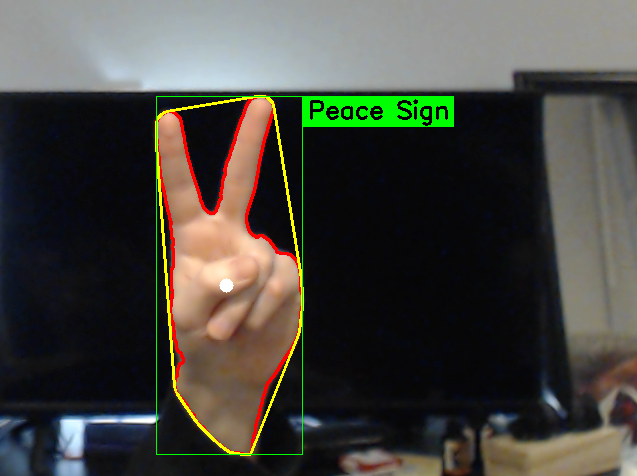

<html>

<body>

<h1>Hand Shape Recognition</h1>
  

 
  Daniel Kehr  
  February 15, 2021

<h2> Problem Definition </h2>

  Hand shape identification is an important problem to tackle in the field of computer vision. Progress on solving such a problem
  aids in bridging the  accessibility gap of the information age. More sophisticated models using hand shape and gesture recognition
  can be used to classify and translate sign language, the model developed here is limited by comparison.  
  The program was developed under the assumption that the user would need classified five distinct hand shapes: fist, fingers extended, peace sign (or two),
  thumbs up, and an L-shape. This program was also built under the assumption that the user has adequate light and a background
  easily distinguishable from their skin tone. 
  Anticipated difficulties included cleanly classifying the user's skin tone, and retrieving binary object shape information from the skin tone contour.

<h2> Method and Implementation </h2>

  The implementation uses openCV's python library to treat a live video feed as a series of still images to be manipulated and analyzed.
  Instead of using template matching through deep learning, I wanted to see how accurate I could make a model using only binary shape
  analysis to classify hand signals.  
  The frame of the video is mirrored for clarity before an outline of the hand is made. Using the dimensions of the outline, the program
  creates a bounding ellipse and finds the centerpoint, as well as the major and minor axes. A convex hull is also drawn around the detected
  hand in order to analyze the hand's solidity (or how much of the convex hull is filled by the hand). The circularity and solidity of the
  hand are compared to values aligning with the five earlier mentioned hand shapes. The shape with the highest correlation is found and we
  print the detected shape to the screen.

  The detect_hand() method analyzes every pixel of the frame and attempts to find those of high probability of being skin. After creating
  the binary image, a contour is drawn around the shapes within the range of skin tone color values specified. The largest of these contours
  is passed to the draw_hand() function which calculates the circularity, direction, and solidity of the outline. Before drawing the outline, convex hull,
  bounding rectangle, center point, and label onto the screen, it calls detect_gesture() to compare the contour values with the corresponding five classes of hand shapes.
  The shape which the contour was most aligned with is returned as a string for the hand's label.

<h2>Experiments</h2>

  Each hand gesture was performed ten times in a random order. Since there are five possible shapes, fifty (50) tests were performed. On account
  of the classification having a tendency to change quickly over time, the user's hand was kept still for three (3) seconds and the most prevalent 
  label was chosen as the estimation.  
  Since there are no true negatives or false positives in our test, only correct gesture and incorrect gesture, accuracy for a given shape will be
  recorded as total correct estimations over the number of tests for that shape (10). 

<h2> Results</h2>

  Given 50 tests and 43 correct estimations, the method had an accuracy of 86%.
 
 Below is a confusion matrix (or as much of one as possible given the task) as well
 as a short sample video of the model in action.

<table>
  <tr>
    <th>Correct Estimations</th>
    <th colspan>Incorrect Estimations</th>
  </tr>
  <tr>
    <td>43</td>
    <td>7</td>
  </tr>
</table>

 
<video width="640" height="480" controls>
  <source src="sample_vid.mp4" type="video/mp4">
Your browser does not support the video tag.
</video>

<table>
<tr><td colspan=3>
<h3>Results</h3>
</td></tr>
<tr>

</tr>
<tr>
  <td>   10 out of 10 correct estimations. </td> 
  <td>   10 out of 10 correct estimations. </td>
</tr> 
<tr>
  <td>   7 out of 10 correct estimations. Sometimes confused with 'Five' shape. </td> 
  <td>   7 out of 10 correct estimations. Sometimes confused with 'None' shape. </td>
</tr> 
<tr>
  <td>   9 out of 10 correct estimations. Sometimes confused with 'Five' shape. </td> 
</tr> 
</table>

<h2> Discussion </h2>

 

  A large strength of the method comes from the fact that it relies solely on binary image analysis; it does not need to perform deep learning at every frame, taking up
  a lot of computational power. Unfortunately, the model has its limitations. The nature of the room's lighting as well as the background heavily influences the accuracy
  since the model requires a clear contrasting skin tone. Also, if the user's head is in the frame, or if the user's hand is in front of the user's face, accuracy will
  drop. If the face and hand are different contours, the hand still needs to be in the foreground to ensure that it is the largest shape on screen. The quick way of
  addressing this is to work under the assumption that the user's hand will be the only part of them on screen. 
  Given the assumptions stated above, I believe the model to be successful: the model tracks and reacts to the user's change in hand shape quickly and with a competitive
  accuracy. In my experiments I expected to find that the peace sign and L-shape would prove itself to be the least accurate estimation since their circularity and direction is similar
  to that of each other. I was proven correct through testing, but did not expect that both would estimate a gesture of a splayed hand instead of each other on their negative estimations.
  I also anticipated skin recognition to be somewhat unpredictable given my complexion. Unfortunately I was proven right since I am both very pale and have a light directly above me 
  at my workstation: the highlights of my hand weren't being included in the contour at the same frequency as the rest of my hand. 
  As for future work, there is plenty of room for improvement. If I had more time, I would likely integrate template matching on top of my basis of binary image analysis to improve accuracy.
  As a challenge I would also attempt to map every letter in the ASL alphabet to a circularity, direction, and solidity range. Perhaps I still will in my free time.
</ul>

<h2> Conclusions </h2>

  As shown above, hand shape identification in a live feed is both feasible and a path I believe to be worth pursuing. Given more time and perhaps team members, identifying gestures through motion
  could also be feasible. The method of identifying hand shapes solely through binary image analysis is a strong foundation for larger and more sophisticated models of hand and gesture recognition in the future.

<h2> Credits and Bibliography </h2>

  
  Vezhnevets, Vladimir, Vassili Sazonov, and Alla Andreeva. "A survey on pixel-based skin color detection techniques." Proc. Graphicon. Vol. 3. 2003. pg. 3 
  <a href="http://citeseerx.ist.psu.edu/viewdoc/download?doi=10.1.1.189.5454&rep=rep1&type=pdf">http://citeseerx.ist.psu.edu/viewdoc/download?doi=10.1.1.189.5454&rep=rep1&type=pdf</a> 
  Accessed 15 February 2021

</body>

</html>
